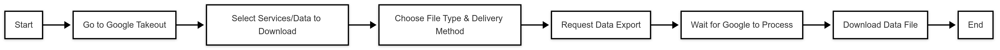
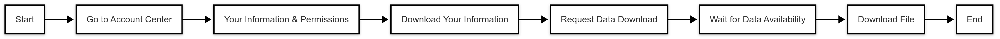
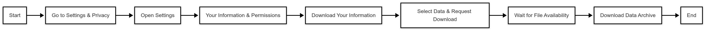
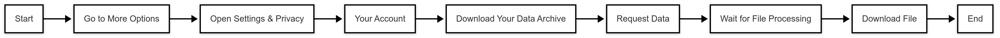

# 不同平台的主题访问

本周记录了我们在不同平台上访问数据的体验，我的记录平台有google，twitter，facebook和instagram。

# google

我发现我无法在常规账户中找到“下载你的数据：”这个选项，然后我发现这个google数据下载的请求通过google takeout来实现的，我们需要自行搜索google takeout来下载自己的数据，这是一个非常灵活方便的网站，可以自行选择导出类型，到导出频率和导出大小，过程十分容易。虽然网页注明了数据准备过程可能需要很长时间（可能会需要几小时或者几天）但是我发出申请到的同一时间就收到了邮件通知数据准备好可以下载了，速度非常可观。文件有一周的保留时间供用户下载。我导出了我一年的数据但是大小只有10mb左右。可以提取的数据有账户活动与日志
访问日志活动、Google 帐户注册及活动记录、联系人及联系人照片
内容与媒体
Gmail 邮件及附件
Google 相册中的照片和视频
YouTube 和 YouTube 音乐中的观看历史、搜索记录、评论及上传内容
Blogger 博客的帖子、页面、评论、视频及相关设置
生产力与工具
日历（iCalendar 格式）
Google Keep 的笔记及附件
Google 文档、表格等（通常通过 Drive 导出）
社交与互动
Google Chat 和 Google 帮助社区的互动记录
Google Groups 的数据
地图与地理位置
地图中的偏好、已保存的地点、时间线数据及我的地图
设备与应用数据
Chrome 浏览器数据（书签、历史记录及设置）
Google Play 相关数据（应用、游戏服务、影视、图书、商店购买记录等）
Google Fit 和 Fitbit 数据（锻炼、睡眠、步数等健康数据）
其他服务
Google Drive 中存储的文件
Google Pay 的交易记录
Google Translate 工具包、Google 商业档案、Google 开发者数据、Google 地球项目等
以及更多（例如课堂、家庭应用、提醒、录音机、搜索贡献等）

# instagram

instagram 在账户中心——你的信息和权限——下载你的信息 里就可以下载账户的全部信息或者部分信息，过程很简单，我在发出申请后的大概两个小时收到了邮件通知数据准备好可以下载，速度也比较快，文件有四天的保留时间供用户下载。我提取到的信息有：1. ads_information（广告信息）
包含你与 Instagram 广告相关的数据，如你看到的广告、点击的广告，以及 Instagram 根据你的兴趣向你推荐的广告内容。
2. apps_and_websites_of_instagram（关联的应用和网站）
记录了你授权 Instagram 访问的第三方应用或网站。
3. connections（连接信息）
可能包含你的好友、关注和粉丝列表、与你互动过的人，以及你加入的群聊等。
4. files（文件）
可能包含你在 Instagram 上上传或存储的某些文件，如数据导出文件。
5. logged_information（登录信息）
可能包括你过去的登录记录、设备信息以及 IP 地址。
6. media（媒体）
这里存储你上传过的照片、视频、故事等。
7. personal_information（个人信息）
可能包含你的姓名、生日、电子邮件、电话号码、简介等个人资料信息。
8. preferences（偏好设置）
记录了你的 Instagram 账户设置、通知偏好、隐私设置等。
9. security_and_login_information（安全与登录信息）
可能包括密码更改历史、安全提示、可疑登录尝试等信息。
10. your_instagram_activity（你的 Instagram 活动）
这是一个比较重要的文件夹，可能包含：
你的搜索记录
点赞、评论、分享的帖子
你的 Instagram 浏览记录
你访问的 Instagram 个人资料等。
11. start_here（起始文件）
可能是一个 HTML 或 PDF 文件，指导你如何查看和理解这些数据。

# facebook

facbook在设置和隐私——设置——你的信息和权限——下载你的信息里可以下载账户的全部信息，寻找的过程我感觉不像Instagram那么简单直接，但facebook可以在线直接访问信息，我申请了下载数据但是过了几个小时后仍旧没有收到邮件或者站内消息。我查阅了社交平台一些发表言论的人称这个实际时间有三天到一个月不等。但是facebook可以直接访问信息：1. 你的 Facebook 动态
你创建的帖子
你被标记的照片
你加入的小组等动态内容
2. 个人信息
你的 Facebook 主页相关信息，例如用户名、个人简介、生日、联系方式等。
3. 社交联系
你建立的好友关系、关注者列表、好友请求等。
你如何与其他用户建立联系，例如通过 Messenger、群组或好友推荐等。
4. 已记录的信息
你在 Facebook 上的活动记录，包括：
位置记录
搜索记录
你访问过的页面和内容
5. 安全与登录信息
你的账户登录历史
登录的设备信息（如 IP 地址、浏览器类型、设备型号）
安全警报和身份验证记录
6. Facebook 站外应用和网站
你授权 Facebook 访问的第三方应用
你使用 Facebook 账号登录的其他网站或应用
Facebook 从这些外部应用和网站收集的动态信息
7. 偏好设置
你在 Facebook 上的个性化设置，例如：
你选择的通知方式
你屏蔽的内容或用户
你对推荐内容的偏好调整
8. 广告信息
你与广告商的互动，包括：
你点击过的广告
你对广告的反馈
Facebook 用于向你推荐广告的兴趣标签
Facebook 还能收集其他隐私信息
除了以上可直接查看的信息，Facebook 还可能收集：

设备信息（你的 IP 地址、设备型号、操作系统）
浏览行为（你访问的内容、停留时长、与内容的互动）
联系人信息（如果你授权 Facebook 访问通讯录，它可能会同步你的联系人）
支付信息（如果你在 Facebook 上有付款记录，如购买 Facebook 广告或 Marketplace 交易）

# twitter

twitter在更多的——设置和隐私——你的账户——下载里的数据档案里可以去下载用户的数据，在应用里需按照这个选项很简单快捷，发起请求是一键发起，但像facebook一样在比较长的时间以后也没有收到回复，当数据档案可供下载时会收到应用内通知以及邮件通知。通过raddit上网友的反应这个过程可能会是需要几天。也无法在线访问信息。同时twitter在申请数据前需要多次重新输入密码和验证。

# 为什么不同的平台的数据导出速度不同？
不同平台的数据导出速度主要不是由您实际使用的次数或数据量决定，而是与平台内部的技术架构、流程设计和优化投入有关。Legacy系统与整合问题：Twitter 和 Facebook在运营多年后，数据存储和处理系统可能由多个历史遗留系统整合而成，导出数据时需要跨多个系统进行整合和转换，处理流程更为复杂。
自动化优化：Google 和 Instagram 对数据导出服务投入了大量资源和自动化技术，优化了打包和传输流程，使得即使数据量大也能迅速生成下载链接。处理流程与安全措施

数据校验和安全检查：Twitter 和 Facebook在生成数据导出文件前，可能会进行多重安全验证和数据校验，以确保数据完整性和安全性，这也会增加处理时间。
人工审核或排队机制：部分平台可能会对数据请求进行人工或半自动化审核，尤其是在高峰期或系统负载较高时，等待时间会更长。
优先级和资源分配

业务重心不同：有的平台将数据导出作为较低优先级的功能，资源投入和优化力度相对较小，而像Google和Instagram可能更加重视用户数据导出的体验，从而加快响应速度。
综上所述，虽然您在Twitter和Facebook上的使用数据较少，但由于平台内部架构、处理流程、安全要求和资源分配等多方面原因，数据导出可能会花费更长时间，而Google和Instagram则通过高度自动化和优化的系统，使导出速度看起来更快。

# 中国的应用软件和这些社交平台的不同

我查看了中国的社交软件比如微博和小红书，他们并没有下载或者访问自己数据的入口，同时我去寻问了客服人员，似乎也没有相应的功能板块，当我发出请求：“我想下载数据”，他们更倾向于引领我到另一些功能上，比如”查看每日流量数据“。我意识到我们好像从来没有注意过我们使用软件时的数据这种东西。后来我了解到了中国的个人信息保护法（pipl）中国的个人信息保护法（PIPL）与GDPR在保护个人数据的目标上有相似之处，都强调保护个人隐私和数据安全。但在具体规定和实施方式上，两者存在差异。GDPR明确规定了数据可携带性，即用户有权以结构化、通用和机器可读的格式下载其个人数据。但是我们的软件平台好像并没有对于数据可携带性和“一键下载”这样的具体技术要求。但是可能某种功能上属于可以访问自己的数据，比如小红书有“查看我的浏览记录”这类数据。

# 可视化
由于我还没有能知道twitter下载数据的类型，所以我想用instagram，google和facebook的数据类型丰富度来做一个可视化。我们要把 Google、Facebook 和 Instagram 提供的数据类型丰富度 以 散点图 形式可视化。类似你提供的代码，我们可以用 多个子图 来展示不同的数据类别在不同平台上的数据覆盖程度。

可视化方案
X 轴：数据类别的索引（即 0, 1, 2, 3, ...）
Y 轴：不同平台的数据丰富度评分（0-10）
不同子图：每个子图代表一个数据类别（例如 "Account Activity"、"Media Content"）
颜色区分平台：
Google - 蓝色
Facebook - 绿色
Instagram - 红色

数据映射
数据类别	Google	Facebook	Instagram
Account Activity	10	8	7
Media Content	10	9	9
Social & Interactions	8	10	9
Location & Maps	10	7	4
Security & Login	7	10	8
Ads & Marketing	9	10	8
Apps & External Websites	9	9	7
我们将用 多个子图 来绘制 散点图，展示各个数据类别在 Google、Facebook、Instagram 上的数据评分情况。

